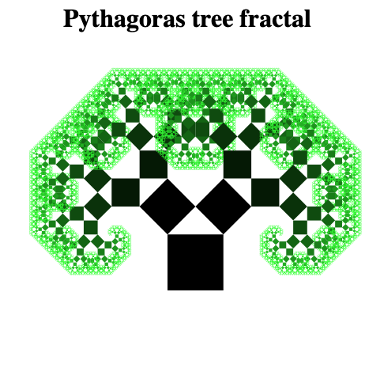

# My own Pythagoras tree fractal in Javascript
This was an old project of mine, when I was starting out writing JavaScript. Thank you for your help [JoostK](https://github.com/JoostK) and [bdupau](https://github.com/bdupau)
For more information on Pythagoras trees, view [Wikipedia](https://en.wikipedia.org/wiki/Pythagoras_tree_%28fractal%29)

-Little mousey
